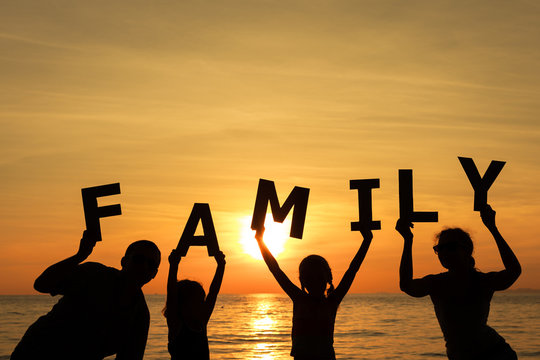
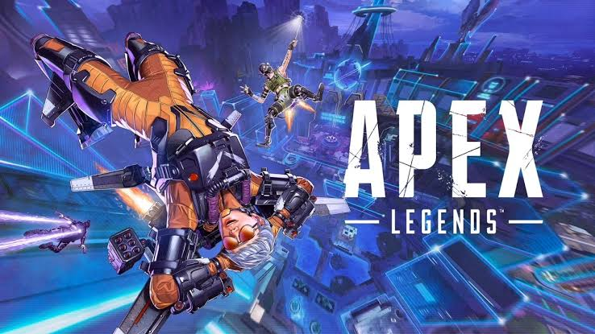
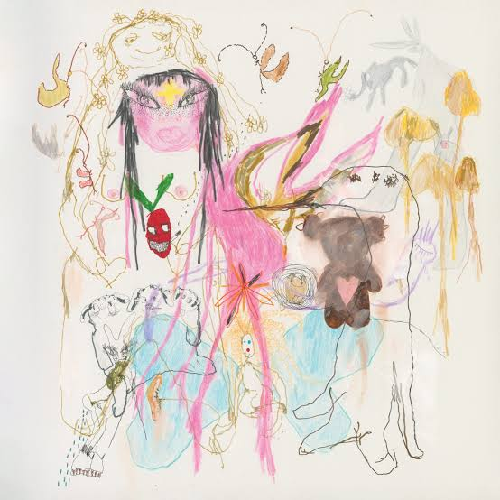
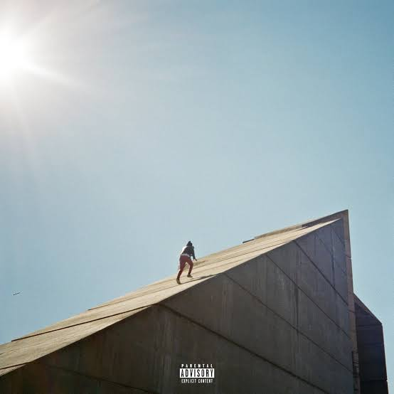
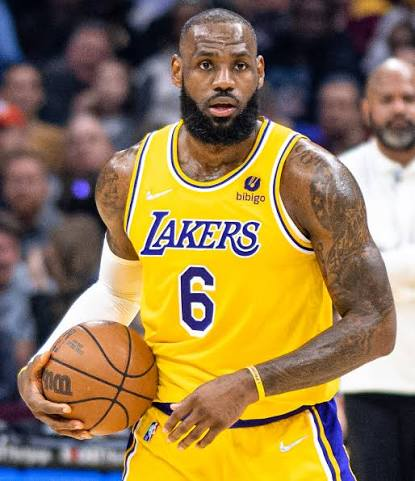
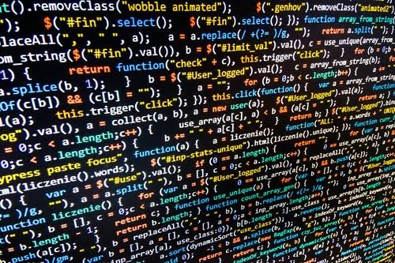
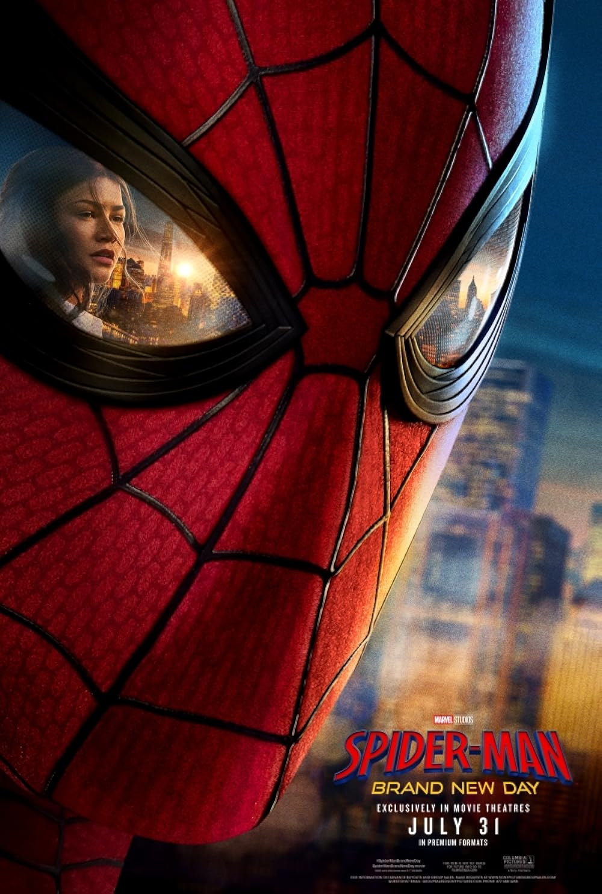

# Me in Markdown Navneet Singh Period 1
Hello My Name is Navneet Singh, I am a current 10th grader going into Chatsworth High School. I am a Christian and I love to program code. I currently as I am writing this am creating two websites. These ones include *AI Social Ease* and *VirusWatch*. Both of which I am using GitHub and I am using VS Code on my home computer, so I am already famililar with both. I am a big frontend guy, I don't really code the backend that much, and I like the front end. I'm not good in HTML I am still getting the ropes, but I do know languages such as JavaScript, Java, and Python. I worked with API keys and starting to work with AI and Machine Learning. 

Currently I am going fully into coding, I want to make my code have impact, I want my skills to help other people. I am trying to increase my expertise and credibility so that when I start getting bigger more impactful projects I can actually be able help other people out because of my knowledge there. I also am a big video game enjoyer, I really like Apex Legends and Minecraft. I am a big Apex legends "***nerd***", the game is very fun to me and over the summer I went from I think silver rank to platinum rank and, while it's not a good thing, I think I have over 100 hours on the game just off the summer.

My favorite movie now is SpiderMan: Brand New Day. While it is a new movie, I thought it was great because my favorite superhero was always SpiderMan and when this movie drop I really feel like it emphasized the emotions of being SpiderMan while also being Peter Parker which I liked. It showed a theme of how putting your work first and trying to make it your whole life, shunning your personal life out and the consequences of that. So I really liked how it showed that theme because that's something I experience a lot with school where I try to make it my whole life and miss out in my personal social life. As you can probably tell I am a **huge** Marvel fan. Some of my other favorite movies are <u>Avengers: Infinity War</u> and <u> Iron Man </u>.

Sincerley,
         
            ***Navneet Singh***

Here is my spotify playlist that I listen to, I recently created this: 
[Playlist](https://open.spotify.com/playlist/37zGJoPzFwh7uH1AyD875J?si=aXJJDIeCT5OxHlzpcgbvrg&utm_source=copy-link&pi=1RZoyu5BTwCpf)

Here is my image collage:

Thank you!

